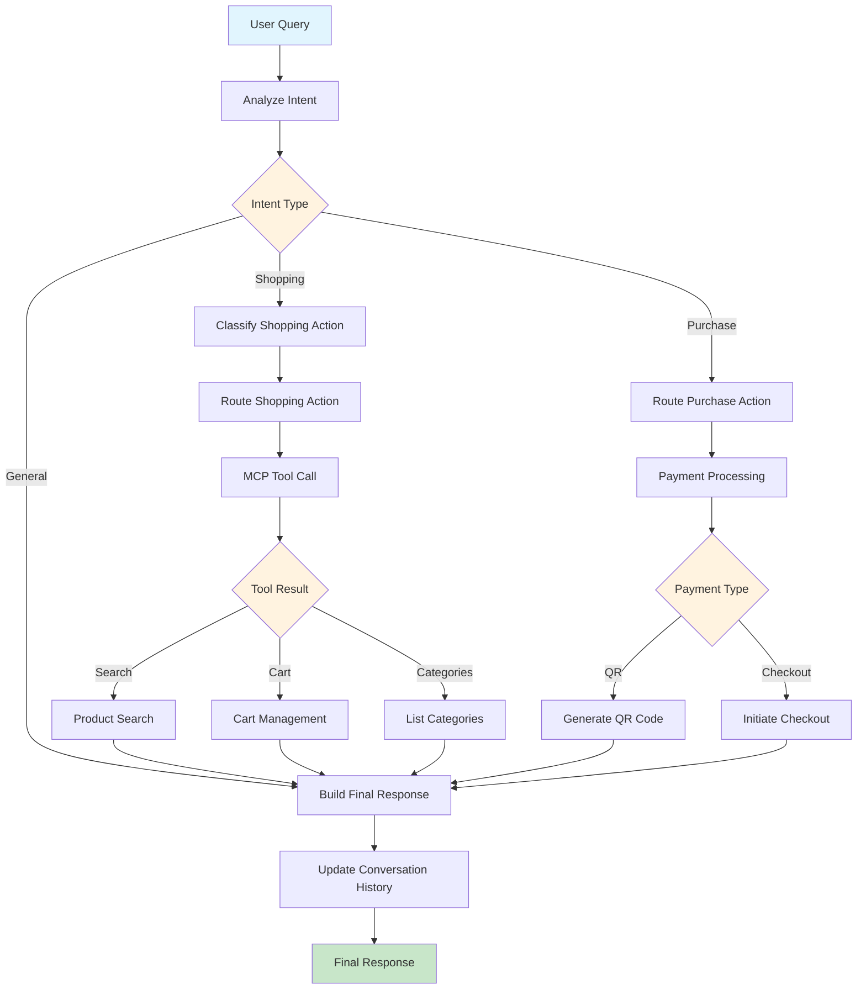

# Shopping Agent

A conversational AI shopping assistant built with LangGraph that handles product search, cart management, and payments through natural language interactions.

## 🚀 Quick Start

### Prerequisites
- Docker
- Git

### 1. Clone & Start Services

```bash
git clone <repository-url>
cd shopping-agent
docker compose up
```

### 2. Setup Ollama Model

```bash
# Access ollama container
docker exec -it ollama /bin/bash

# Inside the container, pull the model
ollama pull gemma3:1b

# Exit container
exit
```

### 3. Test the Application

```bash
# Search for products
curl -X POST http://localhost:5000/query \
  -H "Content-Type: application/json" \
  -d '{"question": "find jackets", "session_id": "test123"}'

# View cart
curl -X POST http://localhost:5000/query \
  -H "Content-Type: application/json" \
  -d '{"question": "view cart", "session_id": "test123"}'

# Search electronics
curl -X POST http://localhost:5000/query \
  -H "Content-Type: application/json" \
  -d '{"question": "search for electronics", "session_id": "test123"}'
```

## 📁 Project Structure

```
shopping-agent/
├── shopping-agent/                 # Main Flask application
│   ├── app/
│   │   ├── agents/
│   │   │   └── shopping_agent/     # LangGraph agent implementation
│   │   │       ├── workflow/       # Workflow logic (graph, nodes, state)
│   │   │       ├── utils/          # Utilities (handlers, processors, formatters)
│   │   │       └── agent.py        # Main agent orchestrator
│   │   ├── services/               # External service clients
│   │   ├── utils/                  # General utilities
│   │   ├── constants/              # Constants and error messages
│   │   └── routes.py               # Flask API routes
│   ├── data/                       # Prompt templates
│   ├── main.py                     # Flask app entry point
│   └── requirements.txt
├── shopping-mcp-server/            # MCP server for e-commerce operations
│   ├── server.py                   # FastMCP server implementation
│   └── requirements.txt
├── docker-compose.yaml             # Service orchestration
└── README.md
```

### Shopping Agent Architecture

```
app/agents/shopping_agent/
├── workflow/                      # Graph workflow components
│   ├── state.py                   # State management utilities
│   ├── nodes.py                   # LangGraph node functions
│   └── graph.py                   # Workflow creation and compilation
├── utils/                         # Supporting utilities
│   ├── processors.py              # Intent/Action/Response processing
│   ├── handlers.py                # MCP tool call handlers
│   ├── error_handlers.py          # Error handling
│   └── formatters.py              # Response formatting
└── agent.py                       # Main agent orchestrator
```

## 🎯 Agent Workflow Diagram



## 🏗️ System Architecture

Coming soon...

## 📡 API Specification

### Base URL
```
http://localhost:5000
```

### Endpoints

#### 1. Query (JSON Response)
**POST** `/query`

Main endpoint for frontend integration. Returns structured JSON with action types.

**Request:**
```json
{
  "question": "find jackets",
  "session_id": "user123"
}
```

**Response:**
```json
{
  "message": "Found 3 products matching 'jackets'...",
  "action_type": "product_search",
  "success": true,
  "products": [
    {
      "id": 1,
      "title": "Mens Casual Jacket",
      "price": 55.99,
      "category": "men's clothing",
      "image": "https://...",
      "rating": 4.5
    }
  ],
  "action_hint": "To add to cart, say 'add product [ID] to cart'"
}
```

#### 2. Query Text (Plain Text Response)
**POST** `/query-text`

Returns plain text response for simple integrations.

**Request:** Same as `/query`

**Response:**
```
Found 3 products matching 'jackets':
[1] Mens Casual Jacket - $55.99
[2] Winter Jacket - $89.99
[3] Sports Jacket - $45.99

💡 To add to cart, say 'add product [ID] to cart'
```

### Action Types

| Action Type | Description | Frontend Use |
|-------------|-------------|--------------|
| `product_search` | Product search results | Show product grid |
| `add_to_cart` | Item added to cart | Show cart notification |
| `remove_from_cart` | Item removed from cart | Update cart display |
| `view_cart` | Cart contents | Show cart summary |
| `clear_cart` | Cart cleared | Show empty cart |
| `categories` | Product categories | Show category list |
| `qr_purchase` | QR payment generated | Display QR code |
| `card_purchase` | Card payment setup | Show payment form |
| `general_chat` | General conversation | Chat bubble |
| `error` | Error occurred | Error message |

### Common Workflows

#### Product Search
```bash
curl -X POST http://localhost:5000/query \
  -H "Content-Type: application/json" \
  -d '{"question": "find electronics", "session_id": "user123"}'
```

#### Add to Cart
```bash
curl -X POST http://localhost:5000/query \
  -H "Content-Type: application/json" \
  -d '{"question": "add product 1 to cart", "session_id": "user123"}'
```

#### Checkout with QR
```bash
# Step 1: Initiate checkout
curl -X POST http://localhost:5000/query \
  -H "Content-Type: application/json" \
  -d '{"question": "checkout", "session_id": "user123"}'

# Step 2: Choose QR payment
curl -X POST http://localhost:5000/query \
  -H "Content-Type: application/json" \
  -d '{"question": "pay with qr", "session_id": "user123"}'
```

### Response Schema

These are all the possible fields that can appear in a JSON response. Only `message`, `action_type`, and `success` are guaranteed to be present.

```javascript
{
  // Standard fields (always present)
  "message": "Natural language response from the agent",
  "action_type": "product_search",
  "success": true,

  // Product data
  "products": [
    {
      "id": 1,
      "title": "Product Name",
      "price": 99.99,
      "category": "electronics",
      "image": "https://example.com/image.jpg",
      "rating": 4.5,
      "quantity": 2,
      "subtotal": 199.98
    }
  ],

  // Cart and pricing
  "total": 199.98,
  "items_count": 3,
  "cart_id": 12345,

  // Payment data
  "qr_code_url": "https://api.omise.co/charges/chrg_xxx/qr_code.png",
  "payment_method": "PromptPay",
  "charge_id": "chrg_xxx",
  "payment_options": ["PromptPay QR", "Credit Card"],

  // Category data
  "categories": ["electronics", "jewelery", "men's clothing", "women's clothing"],

  // User guidance
  "action_hint": "Say 'checkout' to proceed to payment or 'remove product [ID]' to remove items"
}
```

#### Field Descriptions

| Field | Type | Always Present | Description |
|-------|------|----------------|-------------|
| `message` | string | ✅ | Natural language response from the agent |
| `action_type` | string | ✅ | Action type for frontend component routing |
| `success` | boolean | ✅ | Whether the request was processed successfully |
| `products` | array | ❌ | Product objects (search results or cart items) |
| `total` | number | ❌ | Total price for cart or payment operations |
| `items_count` | number | ❌ | Number of items in cart |
| `cart_id` | number | ❌ | Cart identifier from the backend |
| `qr_code_url` | string | ❌ | QR code image URL for PromptPay payments |
| `payment_method` | string | ❌ | Payment method used ("PromptPay", "Credit Card") |
| `charge_id` | string | ❌ | Payment charge identifier |
| `payment_options` | array | ❌ | Available payment methods during checkout |
| `categories` | array | ❌ | Available product categories |
| `action_hint` | string | ❌ | Suggested next actions for the user |

#### Product Object Schema

```javascript
{
  "id": 1,
  "title": "Product Name",
  "price": 99.99,
  "category": "electronics",
  "image": "https://example.com/image.jpg",
  "rating": 4.5,
  "quantity": 2,
  "subtotal": 199.98
}
```

**Note**: `quantity` and `subtotal` only appear for cart items, not search results.

### Error Handling

#### Validation Errors (400)
```json
{
  "message": "Missing or empty 'question' parameter",
  "action_type": "error",
  "success": false
}
```

#### Server Errors (500)
```json
{
  "message": "Sorry, I encountered an error processing your request. Please try again.",
  "action_type": "error", 
  "success": false
}
```

### Session Management

- Each `session_id` maintains separate cart state
- Sessions persist across requests
- Use unique `session_id` per user to avoid cart conflicts
- Default session_id is "default" if not provided

### Natural Language Examples

The agent understands various ways to express the same intent:

**Product Search:**
- "find jackets"
- "search for electronics"
- "show me phones"
- "what products do you have?"

**Cart Management:**
- "add product 1 to cart"
- "remove item 2"
- "show my cart"
- "clear cart"

**Purchase:**
- "checkout"
- "pay with qr"
- "I want to buy these items"

**General:**
- "hello"
- "what can you help me with?"
- "thank you"

## 🐳 Docker Services (Containers)

| Service | Port | Description |
|---------|------|-------------|
| `ollama` | 11434 | LLM inference server |
| `agent` | 5000 | Flask shopping agent API |
| `mcp-server` | 8001 | MCP e-commerce server |
